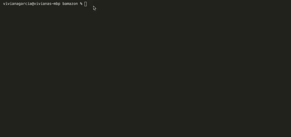

# Bamazon - Node.js & MySQL Application

bamazon is a command line Node.js application that will display a table with available products, their product ID and the cost and customers can purchase products' based on their availability.

## How To Use

**`node bamazonCustomer.js`**

This command will run the bamazon customer application. When run, the store inventory will display. The customer will then be prompted to enter the ID of the product they wish to purchase. Once entered, they will be prompted to enter the quantity. If item quantity is available, then purchase will be successful. If not, they will be prompted so.

## Technology Used

- Visual Studio Code
- JavaScript
- Node.js
- MySQL

